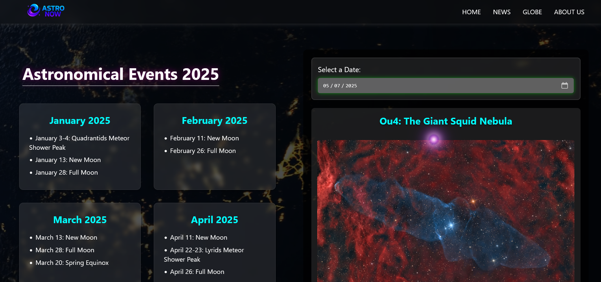
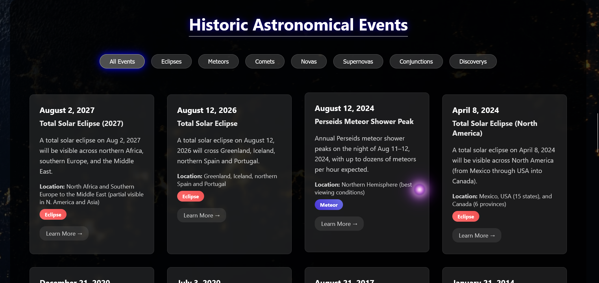
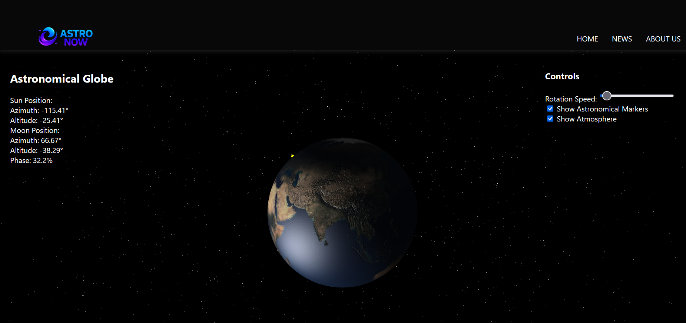

# AstralWeb

**AstralWeb** is a front-end website that caters to your cosmic curiosity, offering rich information about **historical** and **upcoming astronomical events**. Whether you're a stargazer, student, or just someone fascinated by the night sky, AstralWeb helps you explore the universe from your browser.

---

## Features

- Interactive UI with cosmic design elements
- Explore a curated timeline of astronomical events (1900–2027)
- Dynamic daily media via **NASA APOD (Astronomy Picture of the Day)**
- Real-time sun and moon calculations using **SunCalc.js**
- 3D space visualizations with **Three.js**
- Optional weather forecasts for sky visibility
- Responsive and animated using pure HTML, CSS, and JavaScript

---
## Screenshots

### Homepage  


### Historical Events


### Astronomical News


### Globe


## Technologies Used

- **HTML5**
- **CSS3**
- **JavaScript (ES6+)**
- **Three.js** – 3D animations and space rendering
- **SunCalc.js** – for solar/lunar positions
- **Fetch API** – for public API integrations

---

## Data & APIs Used

- **JSON Dataset**: Curated astronomical events (1900–2027)
- **NASA Open APIs**
  - [APOD (Astronomy Picture of the Day)](https://api.nasa.gov/)
- **Spaceflight News API**
  - Real-time and historical spaceflight events
- **Open Meteo API** *(optional)*
  - Sky visibility/weather forecast for stargazing

---

## Setup Instructions

You can either view it live or run it locally:

### Live Deployment

Deployed on [Vercel](https://astronow-two.vercel.app/).

###  Local Setup

To run the project locally:

1. Clone the repository:
   ```bash
   git clone https://github.com/Tushar-designs/AstralWeb.git
   cd astralweb
